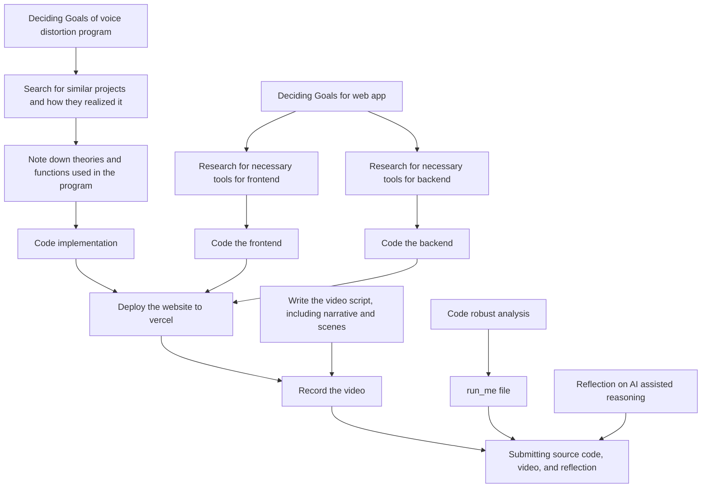
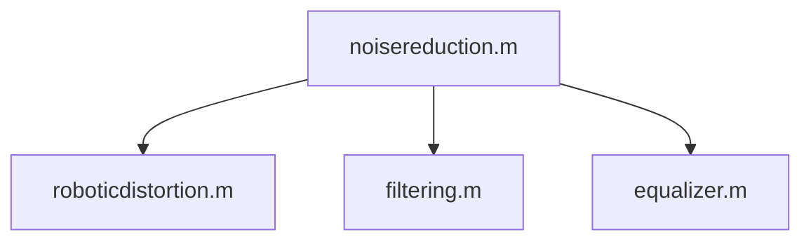

# Voice Distortion Tool

## License 

The code from this repository is licensed under [AGPL-3.0](https://github.com/devkamiki/VoiceDistortion?tab=AGPL-3.0-1-ov-file).

All the sample audio clips except `singing-sample.wav` are downloaded from https://samplefile.com, and usages of them must follow their [ToS](https://samplefile.com/terms-of-service). `singing-sample.wav` is downloaded from https://samplefocus.com/, license of which could be found [here](https://samplefocus.com/license).

## Roadmaps

### Flowchart

### Core
- [x] Low/high pass filtering
- [ ] Equalizer
- [x] Robotic distortion
- [ ] Chorus
- [x] Noise elimination

Preprocessing is a function, to do robotic distortion, run these: in order `noisereduction.m` -> `roboticdistortion.m` 

### Frontend

### Backend

### Robustness Analysis

### Misc
- [ ] `run_me`
- [ ] adjustable extend/strength of effect

## Tutorials on how to use sample files
`music-sample.wav` is for testing `filtering.m`.

`voice-sample.wav` is for testing `roboticdistortion.m`.