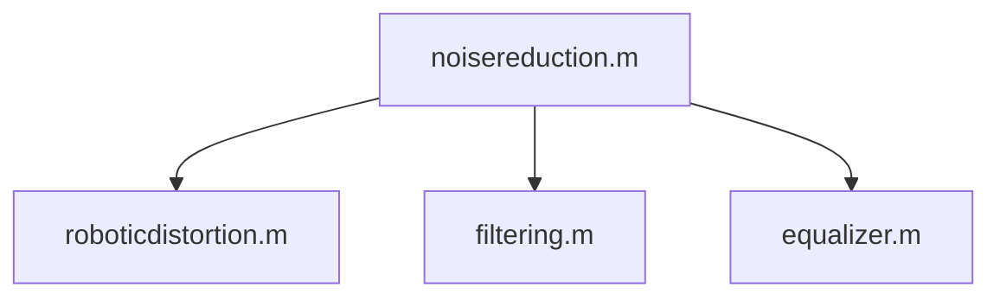

# Voice Distortion Tool

## License [AGPL-3.0](https://github.com/devkamiki/VoiceDistortion?tab=AGPL-3.0-1-ov-file)

## Roadmaps

### Core
- [ ] Pitch change
- [ ] Speed change
- [x] Robotic distortion
- [ ] Timbre change
- [x] Noise elimination (needs improvement)

Preprocessing is a function, to do robotic distortion, run these: in order `noisereduction.m` -> `roboticdistortion.m` 

### Front end

### Back end

### Robustness Analysis

### Misc
- [ ] `run_me`
- [ ] adjustable extend/strength of effect

## Tutorials on how to use sample files
`music-sample.wav` is for testing `filtering.m`.

`voice-sample.wav` is for testing `roboticdistortion.m`.